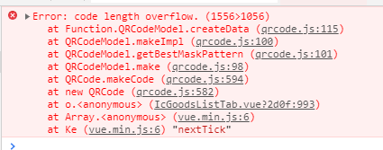

## 问题描述

使用 qrcodejs2 插件生成二维码，按照平时的操作，二维码应该是乖乖显示出来的，但是它这次不想出来，还向我丢了个错误


<!--  -->

## 产生原因

看了报错信息很显然是说`代码长度溢出`,原来是这次传的`url`参数过长了

## 解决方案

1、缩短`url`长度
  - 把url中的参数改为简写缩写，尽量缩短url的长度（但是这种方法不能彻底解决这个问题，说不定以后会有在url后面拼接很多参数的需求，所以这种方式并不建议使用）

2、设置correctLevel参数，参数可选值有以下几种!
  
  -  因为第一种方法行不通，继续找别的解决办法，查询了很多相关的资料，这个插件使用的教程倒是很多，看了一下跟我自己的配置的参数都一样，也没有相关的参数说明，然后通过npm模块找到了qrcodejs的代码仓库，看看有什么不一样

 相关教程代表：

 

 qrcodejs代码仓库示例：

 

 经过对比发现官方的示例多了一个参数`correctLevel : QRCode.CorrectLevel.H`
 然后把这个参数加到我的代码中后，诶，二维码就出来了，接下来看一下这个参数的作用是什么，代码仓库中并没有关于参数的说明

 经过一阵搜索终于在一个名为[前端开发仓库](http://code.ciaoca.com/javascript/qrcode/)的网站中发现了这个参数的说明

 

 这里的说明关于`correctLevel`这个参数翻译为`容错级别`，我这里是有所质疑的，因为通过百度翻译得到的意思是`校正水平`，经过测试当设置等级为`QRCode.CorrectLevel.H`时，我的代码还是会报`Error:code length overflow.`这个错误，设置其他三个代码都可以正常执行，那么这个参数的意思应该为`校正水平`比较恰当，校验等级越高，校验规则越严格，但是它这里写的`默认值`为`QRCode.CorrectLevel.L`,经过测试，当`correctLevel : QRCode.CorrectLevel.L`时，我的代码是可以正常执行的，但是去掉之后，就报错，按理说默认是这个的话，基本上这个值不用设置都可以满足正常需求了，所以这里还有待研究！

